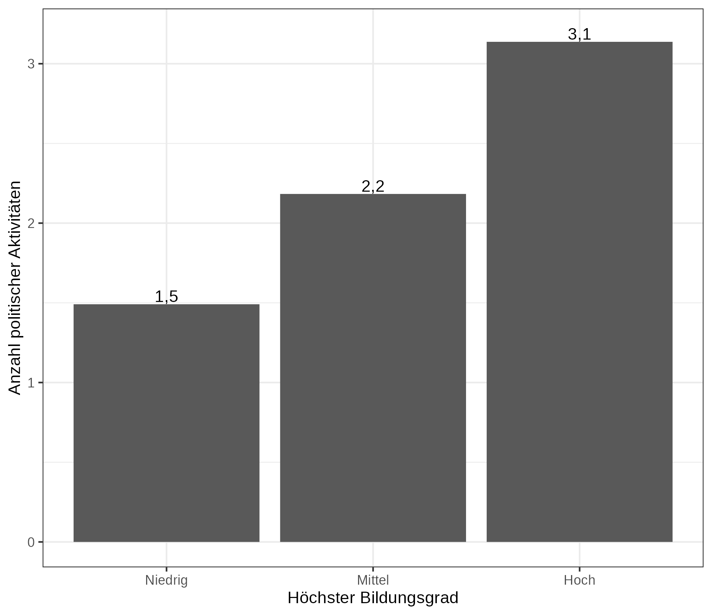

# Datenaufbereitung und Grafiken vom Seminar _Politische Beteiligung und Mobilisierung_

## Rohdaten

**European Social Survey (ESS)**, Welle 9, Deutschland

  - Link: [`data_raw/ESS9DE.dta`](data_raw/ESS9DE.dta)

**International IDEA**, Wahlbeteiligung bei Parlamentswahlen

  - Link: [`data_raw/idea_export_40_63da3e808bc7e.xls`](data_raw/idea_export_40_63da3e808bc7e.xls)

**International Social Survey Programme (ISSP)**, Citizenship Module 2014

  - Link: [`data_raw/ZA6670_v2-0-0.dta`](data_raw/ZA6670_v2-0-0.dta)
  
**Varieties of Democracy**, version 11.1

  - Link: [`data_raw/V-Dem-CY-Core-v11.1.rds`](data_raw/V-Dem-CY-Core-v11.1.rds)

**Varieties of Democracy**, version 12

  - Link: [`data_raw/V-Dem-CY-Full%2BOthers-v12.rds`](data_raw/V-Dem-CY-Full%2BOthers-v12.rds)

## Datenaufbereitung

12.01.2023: **European Social Survey (ESS)**, Welle 9, Deutschland

  - Skript: [`scripts/2023-01-12_ess_datenaufbereitung.R`](scripts/2023-01-12_ess_datenaufbereitung.R)

19.01.2023: **International Social Survey Programme (ISSP)**, Citizenship Module 2014

  - Skript: [`scripts/2023-01-19_issp_datenaufbereitung.R`](scripts/2023-01-19_issp_datenaufbereitung.R)
  
02.02.2023: **International IDEA**, Wahlbeteiligung bei Parlamentswahlen

  - Skript: [`scripts/2023-02-02_idea_datenaufbereitung.R`](scripts/2023-02-02_idea_datenaufbereitung.R)
  
  
## Grafiken

{width=60%} 

